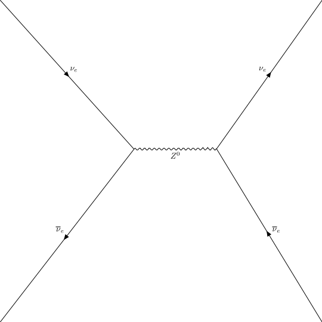
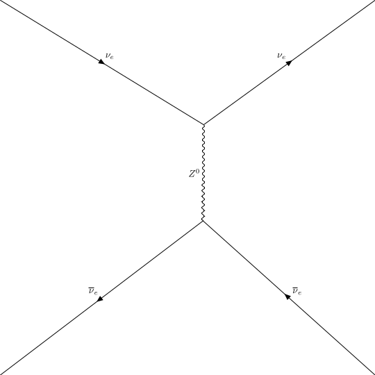

# ufo_draw

Allows you to quickly draw feynman diagrams from ufo model files

## Example

```
ufo_draw --initial "nu_e nu_e_bar" --final "nu_e nu_e_bar" -o diagram -m ufo_sm
```
creates following diagrams via [pyfeyn2](https://github.com/APN-Pucky/pyfeyn2) from the [ufo_sm](https://github.com/APN-Pucky/ufo_sm) model using [pyqgraf](https://github.com/APN-Pucky/pyqgraf).



